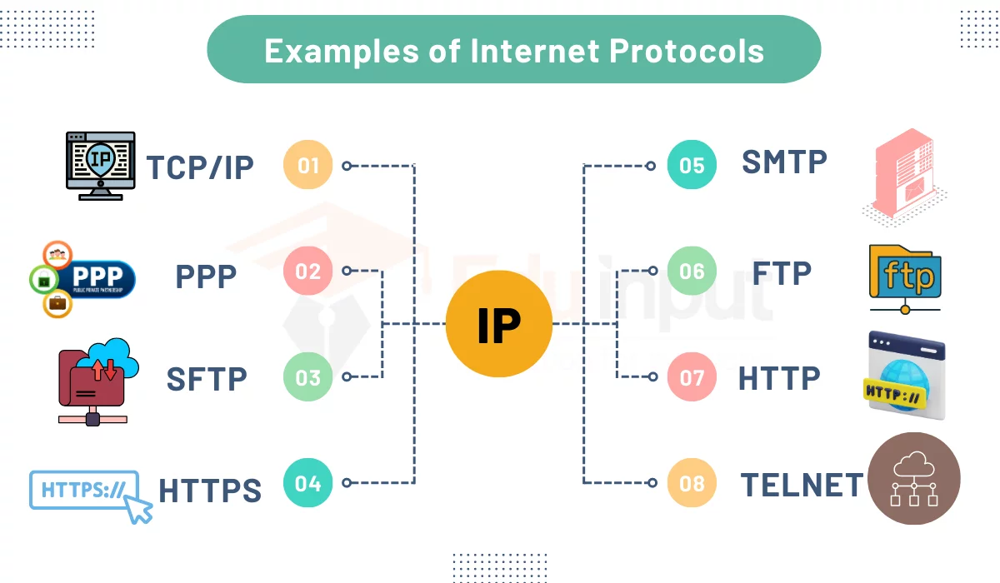
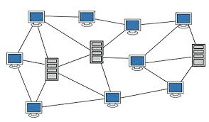
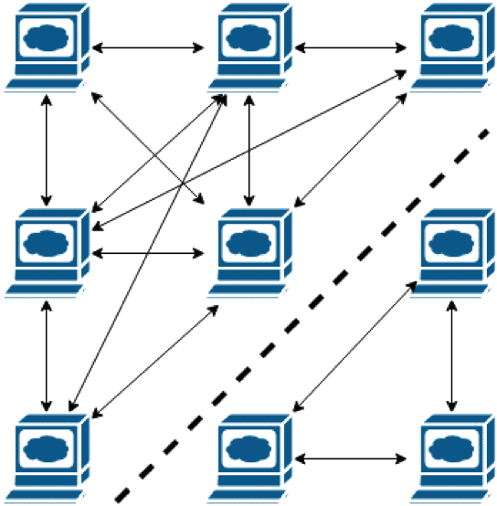
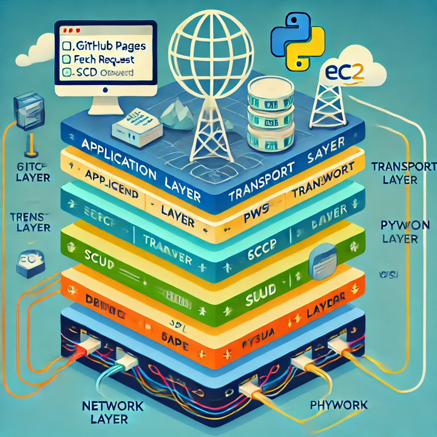
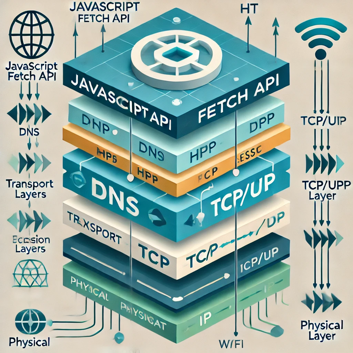

As the assistant scrum master of my group, I helped those in my group to understand the material and improve their features. I assisted with project organization, planning, and task completion. I also supported the Scrum Master and helped plan and manage workload for myself and two other members

<html lang="en">
<head>
    <meta charset="UTF-8">
    <meta name="viewport" content="width=device-width, initial-scale=1.0">
    <title>Amazon EC2 & Docker Notes</title>
</head>
<body>
    <h1>Deployment Procedure</h1>

    <h2>Cockpit</h2>
    
Cockpit is the terminal for the Amazon EC2 server.

    <h2>EC2 Server</h2>
    
Inside the EC2 server, I have a docker container running called <strong>melodymates</strong>.

    
Container running on port <strong>8404</strong>.

    
Container = virtual computer, running our server for the backend.

    
When you get a request to the EC2 server that has the port 8404, our nginx file will help it route to our container.

    
Identifies it based on our unique port.

    <h2>Image & Container</h2>
    
<strong>Image</strong> = blueprint for the virtual computer.

    
<strong>Container</strong> is running this “blueprint.”

    <h2>Docker Commands</h2>
    <ul>
        <li><strong>docker-compose down/up/build</strong></li>
        <li><strong>Down:</strong> Finds what container I’m in, gets rid of the container (not image), and stops it from running.</li>
        <li><strong>Build:</strong> Creates a docker image, creates a blueprint for my container.</li>
        <li><strong>Up:</strong> Runs the blueprint. Takes the image and runs it on port 8404.</li>
    </ul>

    <h2>Docker Overview</h2>
    
<strong>Docker</strong> = Virtual machine, handler for virtual containers.

    <h2>DNS and Routing</h2>
    
When you send a request to the DNS:

    
<strong>DNS:</strong> Instead of typing numbers for a URL, you type <code>melodymates.stu.nighthawkcodingsociety.com</code>.

    
Whenever someone makes a request to the DNS, it will go to our EC2 server, where it gets routed by nginx to our container.

    
The container will process the request and return JSON data back to nginx, and nginx will send it back to the client (the one who sent the request), who can choose what they do with the data.

    <h2>PythonURI</h2>
    
<strong>PythonURI:</strong> URL for melodymates (<code>melodymates.stu.nighthawkcodingsociety.com</code>).

    
DNS takes an IP and makes it look better with a domain name, while PythonURI is a variable in my frontend to reference that link.

    
Goes from <strong>8887 → 8404</strong>.

    
<strong>URI</strong> is an endpoint (URL).

</body>
</html>

<html lang="en">
<head>
    <meta charset="UTF-8">
    <meta name="viewport" content="width=device-width, initial-scale=1.0">
    <title>Key Vocab and Commands</title>
    
</head>
<body>
    <h1>Key Vocab and Commands</h1>
    
    <h2>Key Vocab Terms and Definitions</h2>
    <ul>
        <li><strong>Calling a function:</strong> Running a specific block of code in a program by its name.</li>
        <li><strong>Python URI:</strong> A web address used in Python to access resources like APIs or files.</li>
        <li><strong>Nginx:</strong> A web server that helps manage and speed up website traffic by handling requests efficiently.</li>
        <li><strong>DNS endpoint:</strong> The final destination of a website’s address that connects users to the correct server.</li>
        <li><strong>Dockerfile:</strong> A script that contains instructions for building a containerized application.</li>
        <li><strong>Virtual machine:</strong> A simulated computer that runs inside another computer, acting like a separate system.</li>
        <li><strong>Deployment host:</strong> The server where an application is installed and made available for users.</li>
        <li><strong>Reverse proxy:</strong> A server that forwards client requests to different backend servers, improving security and performance.</li>
    </ul>
    
    <h2>Key Commands and Definitions</h2>
    <ul>
        <li><strong>curl:</strong> A command-line tool used to send and receive data from URLs, often used to test APIs and download files.</li>
        <li><strong>docker-compose.yml:</strong> A file that defines and configures multiple Docker containers to work together.</li>
        <li><strong>docker ps:</strong> Displays a list of running Docker containers.</li>
        <li><strong>sudo:</strong> A command that allows a user to execute tasks with administrator privileges.</li>
        <li><strong>sudo docker-compose up:</strong> Starts and runs all services defined in a Docker Compose file.</li>
        <li><strong>docker-compose up -d --build:</strong> Builds the latest container image and runs services in the background.</li>
        <li><strong>sudo nano projectUniqueName:</strong> Opens a text file in the Nano editor for making changes.</li>
        <li><strong>sudo nginx -t:</strong> Tests the Nginx configuration to check for errors before restarting.</li>
        <li><strong>sudo systemctl restart nginx:</strong> Restarts the Nginx web server to apply new settings.</li>
        <li><strong>sudo certbot --nginx:</strong> Automatically configures HTTPS security for a website using a free SSL certificate.</li>
    </ul>
</body>
</html>

<html lang="en">
<head>
    <meta charset="UTF-8">
    <meta name="viewport" content="width=device-width, initial-scale=1.0">
    <title>Post-Deployment Process</title>
    
</head>
<body>
    <h1>Post-Deployment Process</h1>
    <h2>Updating Repo in the AWS Terminal</h2>
    
When you edit and commit changes on VSCode, they don’t automatically get changed on AWS. The following steps show how this can be done.

    <ol>
        <li>Navigate to the initial directory: <code>cd ~</code></li>
        <li>Navigate into your repo’s directory: <code>cd repo_name</code></li>
        <li>Shutdown the subdomain: <code>docker-compose down</code></li>
        <li>Pull in any changes: <code>git pull</code></li>
        <li>Reinitialize the subdomain: <code>docker-compose up -d</code></li>
    </ol>
</body>
</html>

<html lang="en">
<head>
    <meta charset="UTF-8">
    <meta name="viewport" content="width=device-width, initial-scale=1.0">
    <title>Big Idea 4.1</title>
    
</head>
<body>
    <h1>Big Idea 4.1</h1>
    <ul>
        <li>Computing system = group of computing devices and program working together for a common purpose</li>
        <li>Computer network = group of interconnected computing devices capable of sending or receiving data.</li>
        <li>A path between two computing devices on a network is a sequence of directly connected computing devices (Begins at the sender and ends at the receiver)</li>
        <li>Bandwidth of computer network = maximum amount of data that can be sent in a fixed amount of time (bits/s).</li>
        <li>Packet = Small amount of data sent over a network, includes source and destination info.</li>
        <li>Packet switching = message (file) broken up into packets, sent in any order</li>
        <li>Packets reassembled on recipient's device</li>
    </ul>

    

        
    

    <ul>
        <li>OSI = Open systems interconnect: The layers you have to go through to communicate</li>
        <li>TCP = Transmission control protocol: Establishes common standard for how to send messages between devices on the internet.</li>
        <li>IETF = Internet engineering task force: Manages development of standards and technical discussions regarding the internet.</li>
        <li>NIC = Network Internet Card: Each with unique address, used for local hops</li>
        <li>A packet contains data being transmitted as well as metadata</li>
        <li>Metadata = Data that describes data</li>
        <li>Internet = Computer network of interconnected networks that use standardized communication protocols</li>
        <li>Protocol = Agreed-upon set of rules that specify the behavior of a system.</li>
        <li>Internet = scalable, can change size and scale to meet new demands.</li>
    </ul>

    

        
    

</body>
</html>

<html lang="en">
<head>
    <meta charset="UTF-8">
    <meta name="viewport" content="width=device-width, initial-scale=1.0">
    <title>Big Idea 4.2</title>
    
</head>
<body>
    <h1>Big Idea 4.2</h1>
    <ul>
        <li>Internet engineered to be fault tolerant</li>
        <li>Redundancy = Inclusion of extra components that can be used to mitigate failure of a system if others fail</li>
        <li>Redundancy can be accomplished by having more than one path between devices</li>
        <li>If one device or connection fails, data is sent via a different route</li>
        <li>Fault tolerant = System that can support failures and continue to function</li>
        <li>Redundancy of routing options increases internet reliability</li>
        <li>Fault tolerant if connected to multiple other devices by more than one path</li>
        <li>More devices with more network connections makes network stronger</li>
    </ul>

    

        
    

    <ul>
        <li>Benefits of a fault-tolerant network: Data has more than one possible path, there are backup networks if one fails, and more devices create a stronger network</li>
        <li>Redundancy requires additional resources but can provide the benefit of fault tolerance</li>
        <li>Redundancy of routing options increases reliability, helps it scale to more devices and more people</li>
    </ul>

    

        
    

</body>
</html>

<html lang="en">
<head>
    <meta charset="UTF-8">
    <meta name="viewport" content="width=device-width, initial-scale=1.0">
    <title>Big Idea 4.3</title>
    
</head>
<body>
    <h1>Big Idea 4.3</h1>
    <ul>
        <li>Sequential computing = computational model in which operations are performed in order, one at a time</li>
        <li>Parallel computing = computational model where the program is broken into smaller sequential computing operations</li>
        <li>Distributed computing = computational model in which multiple devices are used to run a program</li>
        <li>Comparing efficiency of solutions: done by comparing time taken to perform the same task</li>
        <li>Sequential solution takes as long as the sum of its steps</li>
        <li>Parallel computing solution takes as long as its sequential tasks plus the longest of its parallel tasks</li>
        <li>"Speedup" of a parallel solution is measured as the time it took to complete the task sequentially divided by the time it took to complete the task when done in parallel</li>
        <li>Parallel computing consists of a parallel portion and a sequential portion</li>
        <li>Solutions using parallel computing can scale more effectively than solutions that use sequential computing</li>
    </ul>

    

        
    

    <ul>
        <li>Distributed computing allows problems to be solved that could not be solved on a single computer due to processing time or storage needs</li>
        <li>Distributed computing allows much larger problems to be solved quicker than with a single computer</li>
        <li>System tasks: The operating system has dozens of tasks, like scheduling what it will be doing next, managing hardware, and working with the network</li>
        <li>User tasks: Executing programs that the user has selected, such as running MS Excel and MS Word, or computer games</li>
        <li>Tasks need to be scheduled by the operating system</li>
        <li>Balance tasks so all CPUs are being used evenly and fully</li>
        <li>Running tasks can be done sequentially, in parallel, and be distributed to other computers</li>
    </ul>

    

        
    

    <ul>
        <li>Sequential computing = Tasks are done one after another. It is a computational model in which operations are performed in order, one at a time</li>
        <li>Limited hardware: It only has one CPU</li>
        <li>Tasks are dependent: Task B depends on task A, task C depends on task B, so the needed order is A, B, and C</li>
        <li>Time equals the longest time taken on any given processor</li>
        <li>A parallel computing solution takes as long as its sequential tasks plus the longest of its parallel tasks</li>
    </ul>
</body>
</html>
