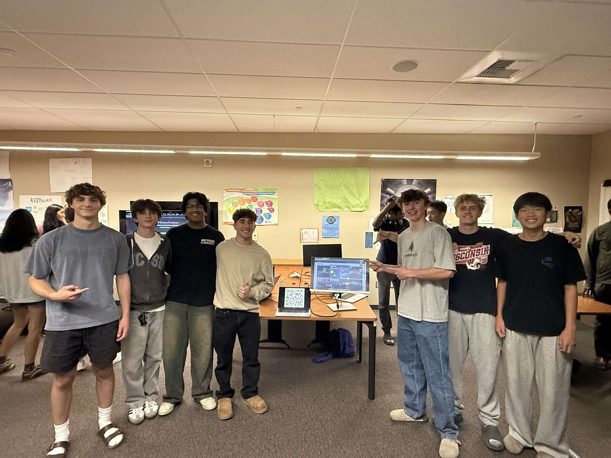

  <h2 style="text-align: center; color: #ff6f00; font-size: 2.2em; text-transform: uppercase; font-weight: bold; margin-bottom: 10px;">
    Final Project Blog
  </h2>
  
June 6, 2025 • 3 min read

<section style="font-family: 'Verdana', sans-serif; line-height: 2; letter-spacing: 0.6px;">

  <!-- ShotSpot Summary -->
  

    <h2 style="color: #3b83a7; font-weight: bold;">ShotSpot – Social Platform for Photographers</h2>
    
I helped create <strong>ShotSpot</strong>, a full-stack social media website built for photographers. Users can:

    <ul>
      <li>Build personal profiles</li>
      <li>Upload, showcase, and caption their work</li>
      <li>Join photography communities for feedback and collaboration</li>
    </ul>
    
This project combines social design, backend functionality, and media-focused UI to support real-world creative expression through tech.

    
<a href="https://tvick22.github.io/ShotSpot/" target="_blank" style="color: #3b83a7; font-weight: bold; text-decoration: underline;">🔗 Visit ShotSpot</a>

  

  <!-- My Contribution -->
  

    <h2 style="color: #d1a745; font-weight: bold;">My Contribution – Profile Page Development</h2>
    <ul>
      <li>Added real-time word count for bios using JavaScript</li>
      <li>Implemented profile picture upload with crop functionality</li>
      <li>Connected all updates to backend for user-specific data storage and retrieval</li>
    </ul>
  

  <!-- Commit Highlights -->
  

    <h2 style="color: #7b4da6; font-weight: bold;">Commit Highlights</h2>
    <ul>
      <li><strong>Frontend:</strong> <a href="https://github.com/Tvick22/ShotSpot/commit/cc6640746fce640b3d76284777155196cbe1d51d" target="_blank">Bio character limit with live counter</a>, <a href="https://github.com/Tvick22/ShotSpot/commit/cc6640746fce640b3d76284777155196cbe1d51d" target="_blank">Dynamic profile save</a></li>
      <li><strong>Backend:</strong> <a href="https://github.com/Tvick22/ShotSpot-Backend/commit/aca296b2a01843dcea7e002fe7c544946add2b58" target="_blank">Unique profile storage for each user</a></li>
    </ul>
  

<!-- Homework Certification -->

  <h2 style="color: #43a047; font-weight: bold;">Homework Certification</h2>
  
I completed <strong>all student-led lesson homework assignments</strong> in Jupyter Notebooks. These tasks deepened my understanding of both technical and ethical computing concepts. They also helped be to prepare for the AP exam.

  <ul>
    <li><a href="https://github.com/BrandonSmurlo/BrandonSmurlo_website/commit/5856fa68df751de0b8d77513b3ee781ecf34cf0f" target="_blank" style="color: #2e7d32; text-decoration: underline;">Digital Divide Homework</a></li>
    <li><a href="https://github.com/BrandonSmurlo/BrandonSmurlo_website/commit/1d149cabca4d0eba830b39bd6feed3737a169f48" target="_blank" style="color: #2e7d32; text-decoration: underline;">Binary Search Homework</a></li>
    <li><a href="https://github.com/BrandonSmurlo/BrandonSmurlo_website/commit/e6162db156f3f1a82863c0692672ea32a5476979" target="_blank" style="color: #2e7d32; text-decoration: underline;">Logic Gates Homework</a></li>
  </ul>
  

<!-- Project Showcase -->

  <h2 style="color: #f9a825; font-weight: bold;">Project Showcase – N@TM</h2>
  
On June 5, I showcased <strong>ShotSpot</strong> at the Night at the Museum (N@TM) event. It was a great opportunity to present the work I had built throughout the year and to reflect on how far both I and my classmates had come. I shared how ShotSpot, a collaborative social platform for photographers, was developed using skills I learned in web development and Open Coding Society. Engaging with peers and visitors at the event made the experience both insightful and rewarding.

  

<!-- Project Stats & Contributions -->

  <h2 style="color: #1976d2; font-weight: bold;">Project Stats</h2>
  
My work on <strong>ShotSpot</strong> and through <strong>Open Coding Society</strong> is reflected in various GitHub contributions:

  <ul>
    <li><strong>Pull Requests:</strong> Our team developed ShotSpot on a forked repo. Once our features were ready, we submitted a pull request to merge our version back into the Open Coding Society repository, following real-world collaboration workflows.</li>
    <li><strong>Commits:</strong> I regularly pushed updates to implement new features and fix issues in both the frontend and backend of the project.</li>
    <li><strong>Issues:</strong> I documented key planning and event tasks, such as this issue for the N@TM event: 
      <a href="https://github.com/BrandonSmurlo/BrandonSmurlo_website/issues/10" target="_blank" style="color: #1565c0; text-decoration: underline;">N@TM GitHub Issue</a>
    </li>
  </ul>
  
Here’s a snapshot of some of the GitHub issues I tracked during development:

  

  
Below is our group’s Kanban board for ShotSpot, showing different team members assigned to tasks throughout the project:

  <!-- Resume -->
  

    <h2 style="color: #56a056; font-weight: bold;">Resume</h2>
    
<a href="https://docs.google.com/document/d/1B0QaIhVHb3YUNxqfFN--mV8CDkQpL8ijoGTbB4Keq0s/edit?usp=sharing" target="_blank" style="color: #2d662d; font-weight: bold; text-decoration: underline;">🔗 View My Resume</a>

  

  <!-- VCard -->
  

    <h2 style="color: #444; font-weight: bold;">Contact Card (+ LinkedIn Post)</h2>
    
<a href="https://brandonsmurlo.github.io/BrandonSmurlo_website/vcard.html" target="_blank" style="color: #444; text-decoration: underline;">🔗 View My vCard</a>

<a href="https://www.linkedin.com/feed/update/urn:li:activity:7336784378057916418/" target="_blank" rel="noopener noreferrer">
  LinkedIn post from N@TM!
</a>

  

  <!-- Certificates -->
  

    <h2 style="color: #825ec6; font-weight: bold;">Certificates</h2>
    <ul>
      <li>Javascript Proficiency Certificate</li>
      <li>Responsive Web Design Certificate</li>
      <li>GitHub Collaboration Certificate</li>
    </ul>
  

  <!-- Tokens -->
  

    <h2 style="color: #ff6f00; font-weight: bold;">Tokens/NFTs</h2>
    <ul>
      <li><strong>Visual Architect:</strong> for crafting a custom and polished layout for the profile page</li>
      <li><strong>Interactive Detail Designer:</strong> for embedding profile bio logic and image cropping into the UI</li>
      <li><strong>Growth Champion:</strong> for showing significant development growth from start to finish</li>
    </ul>
  

  <!-- Future Plans -->
  

    <h2 style="color: #3b83a7; font-weight: bold;">Future Plans for ShotSpot</h2>
    <ul>
      <li>Pitch the platform to the school’s Photography class to get real user feedback</li>
      <li>Share the GitHub and documentation with next year’s CSP students as a learning base</li>
      <li>Turn ShotSpot into a networking tool for high school creatives and college photographers</li>
      <li>Use it as part of an online portfolio to support internship applications</li>
    </ul>
  

  <!-- College Integration -->
  

    <h2 style="color: #d1a745; font-weight: bold;">How I Plan to Implement in College (Finance)</h2>
    
Although I plan to major in a finance-related field, my full-stack and UI/UX skills from ShotSpot will still be extremely valuable:

    <ul>
      <li>Build interactive dashboards and financial tools for analysis</li>
      <li>Use backend logic to manage and interpret large datasets</li>
      <li>Create clean interfaces for financial applications</li>
      <li>Collaborate on finance or research projects needing tech integration</li>
    </ul>
  

</section>

<!-- Internship Relevance -->

  <h2 style="color: #00796b; font-weight: bold;">Internship Relevance & Takeaways</h2>
  
My work on ShotSpot demonstrates technical initiative, problem-solving, and user-focused design — all qualities I can bring to internships. Here’s how I plan to apply these skills in future roles:

  <ul>
    <li><strong>Technical:</strong> Use my full-stack experience to contribute to real-world product development</li>
    <li><strong>Teamwork:</strong> Collaborate effectively with cross-functional teams (designers, engineers, etc.)</li>
    <li><strong>Communication:</strong> Translate technical ideas into user-friendly experiences</li>
    <li><strong>Drive:</strong> Show growth mindset by learning fast and taking ownership of project parts</li>
  </ul>

<!-- Skills for Internships -->

  <h2 style="color: #c2185b; font-weight: bold;">Skills I'm Bringing Into Internships</h2>
  <ul>
    <li><strong>Frontend fluency:</strong> Confident using HTML, CSS, Tailwind, and JavaScript to build polished interfaces</li>
    <li><strong>Problem-solving mindset:</strong> Able to debug issues independently and research solutions</li>
    <li><strong>Version control:</strong> Comfortable using Git/GitHub to collaborate on shared codebases</li>
    <li><strong>User-first design:</strong> Prioritize simplicity, usability, and clarity in all design decisions</li>
  </ul>

<!-- Application Value -->

  <h2 style="color: #5e35b1; font-weight: bold;">Why This Project Stands Out on Applications</h2>
  
Unlike classroom-only work, ShotSpot is a real, functioning website that solves a niche problem. On applications, it proves I can:

  <ul>
    <li>Go beyond templates and build original features from scratch</li>
    <li>Balance visual design with backend functionality</li>
    <li>Launch and maintain a user-focused product in a real-world setting</li>
    <li>Collaborate in a team and use tools professionals rely on</li>
  </ul>

<!-- Internship Interests -->

  <h2 style="color: #00796b; font-weight: bold;">Types of Internships I'm Targeting</h2>
  
I'm looking for internships where I can contribute to projects that matter and continue learning. Some areas that interest me:

  <ul>
    <li>Startup product teams building interactive web apps</li>
    <li>Finance roles needing data visualization or tooling</li>
    <li>Tech internships that combine coding with UX/UI work</li>
    <li>Research labs or nonprofits integrating simple web tools</li>
  </ul>

<!-- Long-Term Vision -->

  <h2 style="color: #8e24aa; font-weight: bold;">Long-Term Vision</h2>
  
My ultimate goal is to merge tech and finance to create tools that make decision-making easier. Whether through investing dashboards, budgeting apps, or economic analysis tools, I plan to:

  <ul>
    <li>Build accessible tools that empower people to understand data</li>
    <li>Use my tech foundation to support business growth and innovation</li>
    <li>Eventually lead product or strategy teams focused on tech-enabled finance</li>
  </ul>

**Self Grade: 0.9**